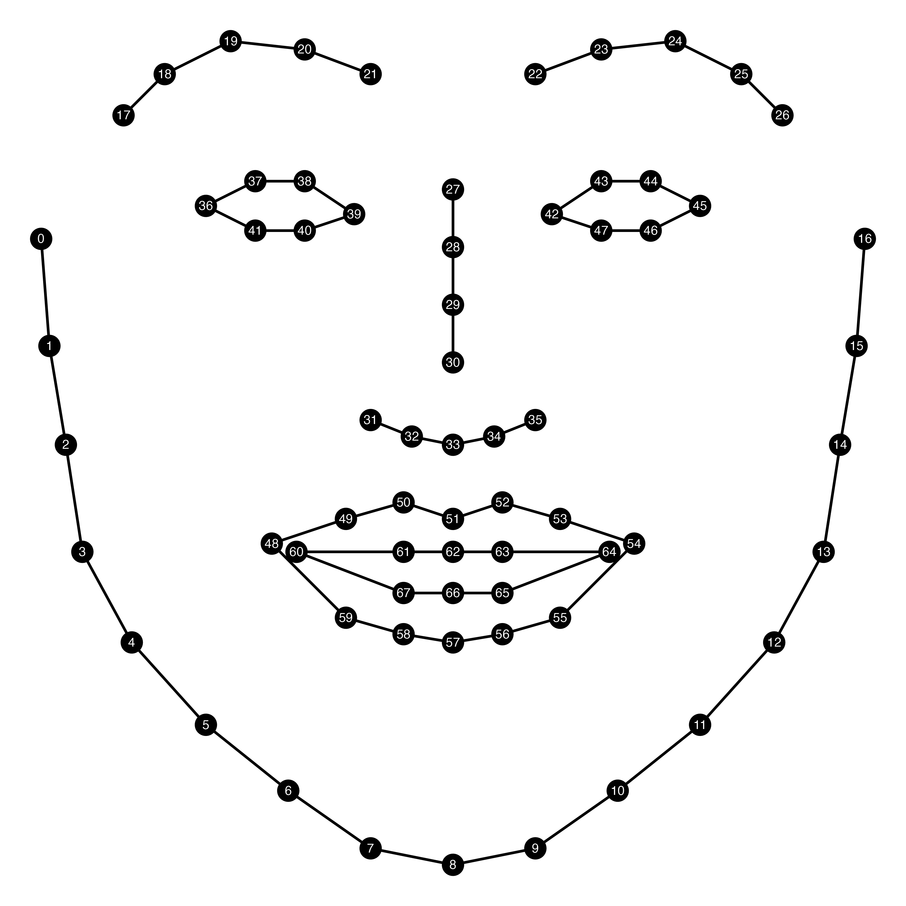
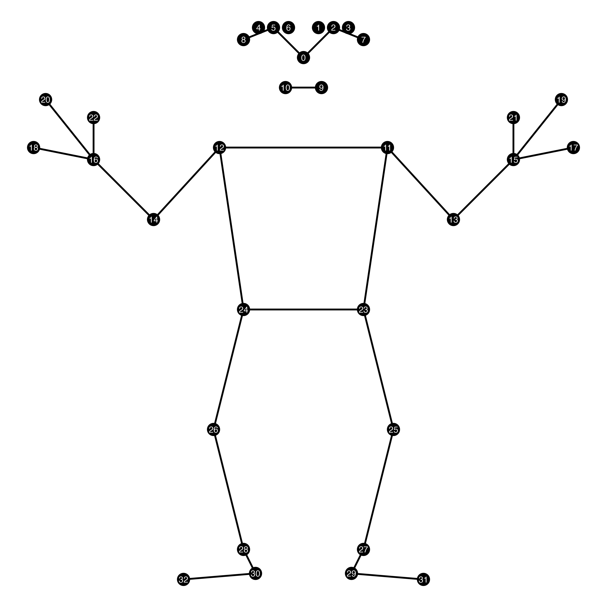
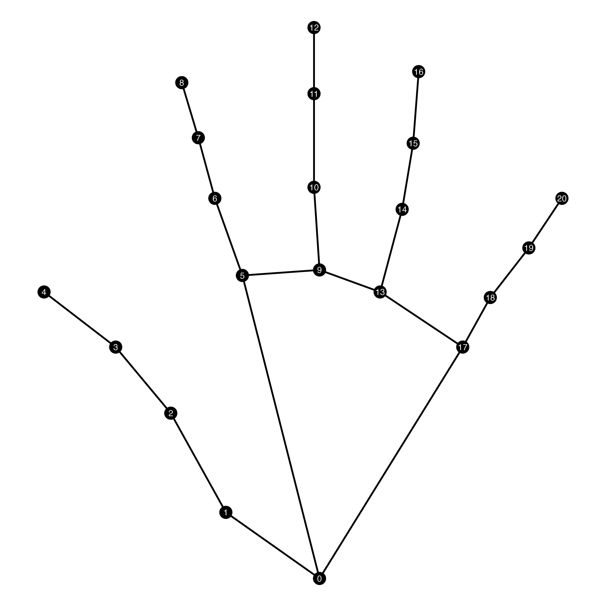
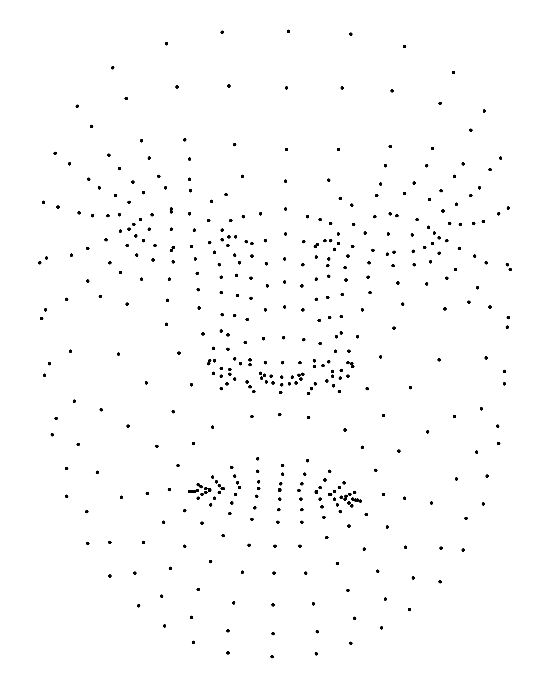

# Computer Vision landmarks

## About

The purpose of this repository is to store basic landmark coordinates for simple visualizations of landmarks in OpenFace and Mediapipe, e.g., when illustrating the output in a _Methodology_ section in a paper or when teaching or presenting at conferences. These are simple single frame/image coordinates from a front-facing angle, with round-ish values normalized within the `[0, 1]` range for simplified handling rather than necessitating running a model on _messy_ data resulting in tilted or asymmetric coordinates.

These coordinates are either manually annotated by myself or generated from single-image outputs from the models themselves in order to create easy-to-read and easy-to-plot landmark coordinates for some common models used for computer vision analysis. You may freely use the coordinatess provided here for your own work (see License). Cite the models (e.g., Mediapipe and OpenFace) used in your work according to their terms of use.

## OpenFace landmarks

Under `data/`, there is a `.csv` file that contains basic coordinates and indices of [OpenFace landmarks](https://openface-api.readthedocs.io/en/latest/openface.html) that can be used to plot a schematic image of the output of OpenFace. 

For example, the following code can be used to plot all landmarks with their corresponding indices and connected into groups:

```r
library(tidyverse)

openface <- 
  read_csv("https://raw.githubusercontent.com/borstell/computer_vision/refs/heads/main/data/openface_landmarks.csv")

openface |> 
  ggplot() +
  geom_path(data = \(x) filter(x, shape == "line"), 
            aes(x, y, group = region)) +
  geom_polygon(data = \(x) filter(x, shape == "polygon"), 
               aes(x, y, group = region), 
               fill = NA, color = "black") +
  geom_point(aes(x, y), size = 3.5) +
  geom_text(aes(x, y, label = landmark), 
            color = "white", 
            vjust = 0.45, 
            size = 1.8, 
            hjust = .5) +
  scale_y_reverse() +
  coord_fixed() +
  theme_void(paper = "white")
```
The code above will generate something like:




## Mediapipe landmarks

### Pose landmarks

Under `data/`, there is a `.csv` file that contains basic coordinates and indices of [Mediapipe landmarks](https://ai.google.dev/edge/mediapipe/solutions/vision/pose_landmarker) that can be used to plot a schematic image of the output of Mediapipe pose estimation. 

For example, the following code can be used to plot all landmarks with their corresponding indices and connected into groups (with some tinkering to join the correct shapes):

```r
library(tidyverse)

mp_landmarks <- 
  read_csv("https://raw.githubusercontent.com/borstell/computer_vision/refs/heads/main/data/mediapipe_landmarks.csv")

mp_landmarks |> 
  ggplot() +
  geom_point(aes(x, y), size = 3) +
  geom_path(data = \(x) filter(x, landmark %in% c(11, 13, 15)),
            aes(x, y)) +
  geom_path(data = \(x) filter(x, landmark %in% c(12, 14, 16)),
            aes(x, y)) +
  geom_path(data = \(x) filter(x, landmark %in% c(23, 25, 27, 29, 31)),
            aes(x, y)) +
  geom_path(data = \(x) filter(x, landmark %in% c(24, 26, 28, 30, 32)),
            aes(x, y)) +
  geom_segment(data = \(x) filter(x, landmark %in% c(15, 17, 19, 21)),
            aes(x = min(x), y = max(y), xend = x, yend = y)) +
  geom_segment(data = \(x) filter(x, landmark %in% c(16, 18, 20, 22)),
               aes(x = max(x), y = max(y), xend = x, yend = y)) +
  geom_path(data = \(x) filter(x, landmark %in% c(0, 2, 5, 7, 8)) |> arrange(x),
               aes(x, y)) +
  geom_path(data = \(x) filter(x, region == "mouth"),
            aes(x, y)) +
  geom_polygon(data = \(x) filter(x, region == "torso") |> arrange(x),
               aes(x, y), fill = NA, color = "black") +
  geom_text(aes(x, y, label = landmark), size = 1.8, color = "white") +
  scale_y_reverse() +
  coord_equal() +
  theme_void(paper = "white")
```


The code above will generate something like:



### Hand landmarks

Under `data/`, there is a `.csv` file that contains basic coordinates and indices of [Mediapipe hand landmarks](https://ai.google.dev/edge/mediapipe/solutions/vision/hand_landmarker) that can be used to plot a schematic image of the output of Mediapipe hand estimation. 

For example, the following code can be used to plot all landmarks with their corresponding indices and connected into groups (with some tinkering to join the correct shapes):

```r
library(tidyverse)

mp_hand <- 
  read_csv("https://raw.githubusercontent.com/borstell/computer_vision/refs/heads/main/data/mediapipe_hand_landmarks.csv")

mp_hand |> 
  ggplot() +
  geom_point(aes(x, y), size = 5) +
  geom_path(data = \(x) filter(x, str_starts(bodypart, "thumb|wrist")), aes(x, y)) +
  geom_path(data = \(x) filter(x, str_starts(bodypart, "index")), aes(x, y)) +
  geom_path(data = \(x) filter(x, str_starts(bodypart, "middle")), aes(x, y)) +
  geom_path(data = \(x) filter(x, str_starts(bodypart, "ring")), aes(x, y)) +
  geom_path(data = \(x) filter(x, str_starts(bodypart, "pinky|wrist")), aes(x, y)) +
  geom_path(data = \(x) filter(x, landmark %in% c(2, 5, 9, 13, 17)), aes(x, y)) +
  geom_text(aes(x, y, label = landmark), color = "white", size = 3) +
  scale_y_reverse() +
  coord_equal() +
  theme_void(paper = "white")
```


The code above will generate something like:



### Face landmarks

Under `data/`, there is a `.csv` file that contains basic coordinates and indices of [Mediapipe face landmarks](https://ai.google.dev/edge/mediapipe/solutions/vision/face_landmarker) that can be used to plot a schematic image of the output of Mediapipe face estimation. 

For example, the following code can be used to plot all landmarks with their corresponding indices and connected into groups (with some tinkering to join the correct shapes):


```r
library(tidyverse)

mp_face <- 
  read_csv("https://raw.githubusercontent.com/borstell/computer_vision/refs/heads/main/data/mediapipe_face_landmarks.csv")

mp_face |> 
  ggplot() +
  geom_point(aes(x, y), size = .2) +
  scale_y_reverse() +
  coord_equal() +
  theme_void(paper = "white")
```

The code above will generate something like:


